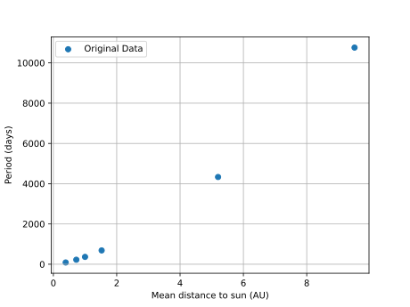
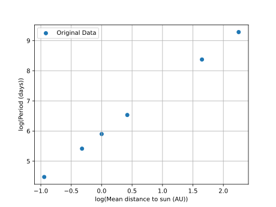
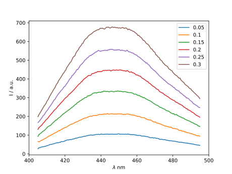
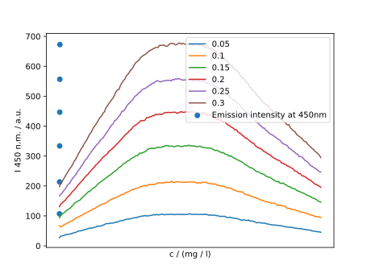
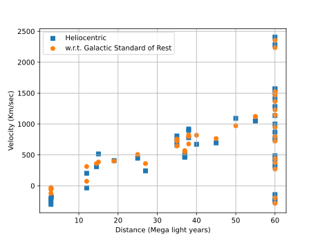
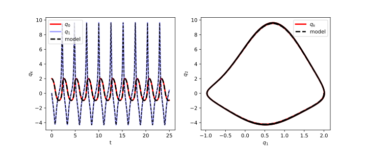

# Linear regression

If we take two variable and graph them against each other we can look for relationships between them. Once this relationship is established we can use that to produce a model which will help us predict values of one variable given the other. 

If the two variables form a linear relationship (a straight line can be drawn to link them) then we can create a linear equation to link them. This will be of the form y = m * x + c, where x is the variable we know, y is the variable we're calculating, m is the slope of the line linking them and c is the point at which the line crosses the y axis (where x = 0). 

[Kepler observed the following relationships between the mean distance of a planet from the Sun to it's period](https://en.wikipedia.org/wiki/Kepler%27s_laws_of_planetary_motion)

| Planet  | Mean distance to sun (AU) |	Period (days) |
|--       | --                        |--             |
| Mercury | 0.389                     |	87.77         |
| Venus   | 0.724                     | 224.70        | 	
| Earth   | 1 	                      | 365.25        |	
| Mars 	  | 1.524                     | 686.95        |
| Jupiter | 5.20                      | 4332.62       |
| Saturn  | 9.510                     | 10759.2       |

Let us plot this data

~~~
import matplotlib.pyplot as plt

def make_plot(x_data, y_data, x_label, y_label):
    plt.scatter(x_data, y_data, label="Original Data")
    plt.grid()
    plt.legend()
    plt.xlabel(x_label)
    plt.ylabel(y_label)
    plt.savefig("planets_graph.svg")
    
x_data = [0.389,0.724,1,1.524,5.20,9.510]
y_data = [87.77,224.70,365.25,686.95,4332.62,10759.2]
x_label = "Mean distance to sun (AU)"
y_label = "Period (days)"
make_plot(x_data, y_data, x_label, y_label)

~~~
{: .python}



The graph shows that as the distance from the sun increases, so does the time to complete a single orbit.
However, the relationship is not linear.  One can use logarithms to see if there is a power law 
relationship.

> ## Logarithms Introduction
> Logarithms are the inverse of an exponent (raising a number by a power). 
> logb(a) = c 
> b^c = a
> For example:
> 2^5 = 32
> log2(32) = 5
> If you need more help on logarithms see the [Khan Academy's page](https://www.khanacademy.org/math/algebra2/exponential-and-logarithmic-functions/introduction-to-logarithms/a/intro-to-logarithms)
> {: .callout}

Therefore, one can plot

~~~
import matplotlib.pyplot as plt
import numpy as np

def make_plot(x_data, y_data, x_label, y_label):
    plt.scatter(x_data, y_data, label="Original Data")
    plt.grid()
    plt.legend()
    plt.xlabel(x_label)
    plt.ylabel(y_label)
    plt.savefig('planets_log_graph.svg')

x_data = [0.389,0.724,1,1.524,5.20,9.510]
y_data = [87.77,224.70,365.25,686.95,4332.62,10759.2]
log_x_data = np.log(x_data)
log_y_data = np.log(y_data)
x_label = "log(Mean distance to sun (AU))"
y_label = "log(Period (days))"
make_plot(log_x_data, log_y_data, x_label, y_label)

~~~
{: .python}



In this case, there is an approximate linear relationship. The coefficients can also be calculated

## Coding a linear regression with Python 
This code will calculate a least squares or linear regression for us.

~~~
def least_squares(data):
    x_sum = 0
    y_sum = 0
    x_sq_sum = 0
    xy_sum = 0

    # the list of data should have two equal length columns
    assert len(data[0]) == len(data[1])
    assert len(data) == 2

    n = len(data[0])
    # least squares regression calculation
    for i in range(0, n):
        x = data[0][i]
        y = data[1][i]
        x_sum = x_sum + x
        y_sum = y_sum + y
        x_sq_sum = x_sq_sum + (x**2)
        xy_sum = xy_sum + (x*y)

    m = ((n * xy_sum) - (x_sum * y_sum))
    m = m / ((n * x_sq_sum) - (x_sum ** 2))
    c = (y_sum - m * x_sum) / n

    print("Results of linear regression:")
    print("m=", m, "c=", c)

    return m, c
~~~
{: .python}

Lets test our code.

~~~
least_squares([log_x_data,log_y_data)])
~~~
{: .python}

We should get the following results:

~~~
Results of linear regression:
m= 1.5031353477782914 c= 5.897898811978949
~~~

This validates Kepler's observation that `(Mean distance to sun )^3 ∝ (Period )^2` 

### Testing the accuracy of a linear regression model

We now have a simple linear model for some data. It would be useful to test how accurate that model is. We can do this by computing the y value for every x value used in our original data and comparing the model's y value with the original. We can turn this into a single overall error number by calculating the root mean square (RMS), this squares each comparison, takes the sum of all of them, divides this by the number of items and finally takes the square root of that value. By squaring and square rooting the values we prevent negative errors from cancelling out positive ones. The RMS gives us an overall error number which we can then use to measure our model's accuracy with. The following code calculates RMS in Python. 

~~~
import math
def measure_error(data1, data2):
    assert len(data1) == len(data2)
    err_total = 0
    for i in range(0, len(data1)):
        err_total = err_total + (data1[i] - data2[i]) ** 2

    err = math.sqrt(err_total / len(data1))
    return err
~~~
{: .python}

To calculate the RMS for the test data we just used we need to calculate the y coordinate for every x coordinate that we had in the original data. 

~~~
# get the m and c values from the least_squares function
m, c = least_squares([log_x_data,log_y_data])

# create an empty list for the model y data
fitted_data = np.exp(c) * np.power(x_data,m)

# calculate the error
print(measure_error(y_data,fitted_data))
~~~
{: .python}

This will output an error of 3.813100984286817, which means that on average the difference between our model and the real values is 3.813100984286817. If the model perfectly matches the data then the value will be zero.

> # Predicting the Period of Pluto
> 
> Pluto also orbits the sun. Can you use the fitted model to predict the period of Pluto?
> Some information on Pluto can be found on
> [Wikipedia](https://en.wikipedia.org/wiki/Pluto) as well as on 
> [NASA's website](https://solarsystem.nasa.gov/planets/dwarf-planets/pluto/in-depth/)  
>
> > ## Solution
> >
> > From the above links, Pluto has an average distance from the Sun 
> > of 39.5 AU.
> > 
> > m= 1.5031353477782914 c= 5.897898811978949
> > ~~~
> > print( np.exp(5.897898811978949) * np.power(39.5,1.5031353477782914))
> > ~~~
> > {: .python}
> > predicted period: 91480.05972244845 days, actual period 90520 days
> >
> > This is not bad, however, the input data is far outside the
> > range of the values used to fit the model.  Discuss whether
> > this could cause problems if used for prediction in other 
> > scenarios? What other reasons might account for this discrepancy?
> {: .solution}
{: .challenge}

> # An Updated Regression Model 
> 
> The [Wikipedia page on Kepler's laws of planetary motion](https://en.wikipedia.org/wiki/Kepler%27s_laws_of_planetary_motion) 
> has updated measurements of the astronomical
> distance from the sun and the period which are listed below.
>
> | Planet  | Semi-major axis around the sun (AU) | Period (days) |
> |--       | --                                  |--             |
> | Mercury | 0.38710                             | 87.77         |
> | Venus   | 0.7233                              | 224.70        |
> | Earth   | 1                                   | 365.25        |
> | Mars    | 1.52366                             | 686.95        |
> | Jupiter | 5.20336                             | 4332.62       |
> | Saturn  | 9.510                               | 10759.2       |
> | Uranus  | 19.1913                             | 30687.153     |
> | Neptune | 30.0690                             | 60190.03      |
>
> Use this data to fit a regression model and estimate the period 
> of Pluto. 
>
> > ## Solution
> > 
> > ~~~
> > x_distance = [0.38710,0.7233,1,1.52366,5.20336,9.510,19.1913,30.0690]
> > y_period = [87.77,224.70,365.25,686.95,4332.62,10759.2,30687.153,60190.03]
> > m, c = least_squares([np.log(x_distance),np.log(y_period)])
> > pluto_au = 39.5
> > print( np.exp(c) * np.power(pluto_au,m))
> > ~~~
> > {: .python}
> >
> > Results of linear regression:
> > m= 1.5003670408045884 c= 5.900201729955274
> > predicted period: 90762.55504601273 days, actual period 90520 days
> > 
> > The results of this prediction are better than the previous one.
> > The method may still be unsatisfactory. Rudy, Brunton, Proctor  
> > and Kutz propose to use 
> > [Data-driven discovery of partial differential equations](https://arxiv.org/abs/1609.06401) 
> > as one method of fitting dynamical equations.
> >
> > The current fitted model does not account for the influence of the 
> > orbiting bodies on each other. Furthermore, 
> > [general relativity](https://en.wikipedia.org/wiki/Two-body_problem_in_general_relativity)
> > can better describe the orbits of bodies around the sun. Discuss 
> > how you might examine the data to separate effects of measurement 
> > errors from modelling errors in the choice of model to apply 
> > regression fitting to.
> {: .solution}
{: .challenge}

> # Using Regression in Spectroscopy
>
> Regression is also used to calibrate instruments. As an example,
> flourescence emission spectra obtained from different concentrations 
> of a quinine solution can then be used to estimate the concentration 
> of other quinine solutions. More details are availabe in this 
> [R Vignette](http://cran.uni-muenster.de/web/packages/hyperSpec/vignettes/flu.pdf).
> A figure of the spectra data obtained by M. Kammer shows that emissions 
> are greatest at a wavelength of 450 nm for an input excitation at 350 nm. 
>
>  
>
> Thus data at his wavelength can be used for calibrating a linear
> regression model.
>
> | Concentration c / (mg / l) | Emission I 450 n.m. / a.u. |
> |--                          |--                          | 
> | 0.05                       | 106.95                     |
> | 0.10                       | 213.50                     |
> | 0.15                       | 333.78                     |
> | 0.20                       | 446.63                     |
> | 0.25                       | 556.52                     |
> | 0.30                       | 672.53                     |
>
> ~~~
> import matplotlib.pyplot as plt
> import pandas as pd
> import numpy as np
>
> def least_squares(data):
>   x_sum = 0
>   y_sum = 0
>   x_sq_sum = 0
>   xy_sum = 0
>
>   # the list of data should have two equal length columns
>   assert len(data[0]) == len(data[1])
>   assert len(data) == 2
>   n = len(data[0])
>   # least squares regression calculation
>   for i in range(0, n):
>       x = data[0][i]
>       y = data[1][i]
>       x_sum = x_sum + x
>       y_sum = y_sum + y
>       x_sq_sum = x_sq_sum + (x**2)
>       xy_sum = xy_sum + (x*y)
>
>   m = ((n * xy_sum) - (x_sum * y_sum))
>   m = m / ((n * x_sq_sum) - (x_sum ** 2))
>   c = (y_sum - m * x_sum) / n
>
>   print("Results of linear regression:")
>   print("m=", m, "c=", c)
>
>   return m, c
>
> def make_plot(x_data, y_data, x_label, y_label):
>    plt.clf()
>    plt.scatter(x_data, y_data, label="Emission intensity at 450nm")
>    plt.grid()
>    plt.legend()
>    plt.xlabel(x_label)
>    plt.ylabel(y_label)
>    plt.savefig("emission_response_at_450nm.svg")
>
> spectral_data = pd.read_csv("machine-learning-novice/data/spectral_data.csv")
> concentration_data = pd.read_csv("machine-learning-novice/data/concentration_data.csv")
> fig = plt.figure()
> plt.clf()
> ax = fig.add_subplot(111)
> ax.plot(spectral_data.columns.values.astype(np.float),
>         spectral_data.iloc[0].values,
>         label=str(concentration_data.values[0][0]))
> ax.plot(spectral_data.columns.values.astype(np.float),
>         spectral_data.iloc[1].values,
>         label=str(concentration_data.values[1][0]))
> ax.plot(spectral_data.columns.values.astype(np.float),
>         spectral_data.iloc[2].values,
>         label=str(concentration_data.values[2][0]))
> ax.plot(spectral_data.columns.values.astype(np.float),
>         spectral_data.iloc[3].values,
>         label=str(concentration_data.values[3][0]))
> ax.plot(spectral_data.columns.values.astype(np.float),
>         spectral_data.iloc[4].values,
>         label=str(concentration_data.values[4][0]))
> ax.plot(spectral_data.columns.values.astype(np.float),
>         spectral_data.iloc[5].values,
>         label=str(concentration_data.values[5][0]))
> ax.autoscale(enable=True, axis='x', tight=True)
> ax.set_xticks([400,420,440,460,480,500])
> ax.set_xticklabels(['400','420','440','460','480','500'])
> plt.legend()
> plt.xlabel("$\lambda$ nm")
> plt.ylabel("I / a.u.")
> plt.savefig('spectral_responses.svg')
> x_label = "c / (mg / l)"
> y_label = "I 450 n.m. / a.u."
> make_plot(concentration_data.values[:,0], spectral_data["450"].values, x_label, y_label)
>
> ~~~
> {. :python}
> 
> 
>
> Results of linear regression:
> m= 2268.46285714286 c= -8.66266666666714
> It is possible to compute further fitting statistics,
> rather than program this directly, one can use the
> [statsmodels](https://www.statsmodels.org/stable/regression.html)
> package.

# Multilinear Regression

One can extend regression models to have more than one dependent variable. Rather, than
give full details of the derivation, a demonstration will be provided. Many datasets
contain correlated variables.  Regression can help determine correlation between variables.
A dataset of interest is the simulated 
[Major Atmospheric Gamma Imaging Cherenkov Telescope project (MAGIC)](https://archive.ics.uci.edu/ml/datasets/magic+gamma+telescope) 
dataset. The dataset contains simulations which have data that distinguishes between 
detecting background noise and high energy gamma particles. Here, multilinear regression will 
be used to show that some of the measurements are correlated.

First setup the environment and read in the data and examine the first few entries
```python
import numpy as np
import pandas as pd
from sklearn.linear_model import LinearRegression
magic_data=pd.read_csv('../data/magic04.data',sep=',',header=None)
print(magic_data.head())
```

Then extract the row entries which correspond to gamma particles and drop
the column with the label for gamma particles
```python
magic_data_gamma = magic_data.query( '@magic_data[10] == "g"')
magic_data_gamma = magic_data_gamma.drop(
    magic_data_gamma.columns[[10]], axis = 1)
```

The resulting dataframe has the following columns:

    1.  fLength:  continuous  # major axis of ellipse [mm]
    2.  fWidth:   continuous  # minor axis of ellipse [mm] 
    3.  fSize:    continuous  # 10-log of sum of content of all pixels [in #phot]
    4.  fConc:    continuous  # ratio of sum of two highest pixels over fSize  [ratio]
    5.  fConc1:   continuous  # ratio of highest pixel over fSize  [ratio]
    6.  fAsym:    continuous  # distance from highest pixel to center, projected onto major axis [mm]
    7.  fM3Long:  continuous  # 3rd root of third moment along major axis  [mm] 
    8.  fM3Trans: continuous  # 3rd root of third moment along minor axis  [mm]
    9.  fAlpha:   continuous  # angle of major axis with vector to origin [deg]
    10. fDist:    continuous  # distance from origin to center of ellipse [mm]


We will fit a regression model for fDist (the distance from origin to center of ellipse)
as a function of the other quantities. Therefore, split the dataframe into a single
column for fDist and a dataframe for the dependent variables, then use the scikit-learn
regression fitting routine and calculate the quality of the fit using the R^2 value.

```python
fDist = magic_data_gamma[[9]]
Variables = magic_data_gamma.drop(magic_data_gamma.columns[[9]], axis = 1)
reg = LinearRegression().fit(Variables,fDist)
print(reg.score(Variables,fDist))
```

The result of this gives an R^2 value of 0.42985458535037824 indicating some amount
of correlation between fDist and the other dependent variables.

> # Discussion
> 
> Multilinear regression has been applied without any modelling assumptions
> to fit a physics based model or derive a physics based model. What other
> work can you find on the internet that uses the 
> [Major Atmospheric Gamma Imaging Cherenkov Telescope project (MAGIC)](https://archive.ics.uci.edu/ml/datasets/magic+gamma+telescope)
> data?
> > ## Partial Solution
> > The original paper describing the collection of the data and its
> > analysis is
> > [Methods for multidimensional event classification: a case study using images from a Cherenkov gamma-ray telescope](http://www.cs.cas.cz/~savicky/papers/magic_case_study.pdf) 
> >
> > The dataset is also listed in the 
> > [Open Machine Learning project](https://www.openml.org/d/1120)
> > 
> {: .solution}
{: .challenge}

> # Exercise
>
> Estimating the constant in the
> [Hubble–Lemaître law](https://en.wikipedia.org/wiki/Hubble%27s_law)
> has been challenging. Ignore the warning at
> "[Redshift data for Messier Galaxies](http://www.messier.seds.org/xtra/supp/redshift.html)"
> and see what constant can be deduced, from this data:
>
> | Galaxy |NGC  | RA         |      Dec  | Dist | RV_hel     | RV_gal |
> |--      |--   |--          |--         |--    |--          |--      |
> | M31    |224  | 00:42:44.3 | +41:16:09 |  2.9 | -300 +/- 4 | -122   |  
> | M32    |221  | 00:42:41.8 | +40:51:52 |  2.9 | -205 +/- 8 | - 28   |
> | M33    |598  | 01:33:50.9 | +30:39:37 |  3.0 | -179 +/- 3 | - 44   |  
> | M49    |4472 | 12:29:46.8 | +08:00:02 | 60   |  868 +/- 8 |  800   |
> | M51    |5194 | 13:29:52.3 | +47:11:54 | 37   |  463 +/- 3 |  551   |
> | M51B   |5195 | 13:29:58.7 | +47:16:04 | 37   |  465 +/-10 |  553   |
> | M58    |4579 | 12:37:43.5 | +11:49:05 | 60   | 1519 +/- 6 | 1468   |
> | M59    |4621 | 12:42:02.5 | +11:38:49 | 60   |  424 +/-12 |  375   |
> | M60    |4649 | 12:43:39.6 | +11:33:09 | 60   | 1413 +/-10 | 1364   |
> | M61    |4303 | 12:21:54.9 | +04:28:25 | 60   | 1566 +/- 2 | 1483   |
> | M63    |5055 | 13:15:49.2 | +42:01:49 | 37   |  504 +/- 4 |  570   |
> | M64    |4826 | 12:56:44.2 | +21:41:05 | 19   |  408 +/- 4 |  400   |
> | M65    |3623 | 11:18:55.2 | +13:05:35 | 35   |  807 +/- 3 |  723   |
> | M66    |3627 | 11:20:15.0 | +12:59:30 | 35   |  727 +/- 3 |  643   |
> | M74    |628  | 01:36:41.7 | +15:46:59 | 35   |  657 +/- 1 |  755   |
> | M77    |1068 | 02:42:40.7 | -00:00:48 | 60   | 1136 +/- 4 | 1145   |
> | M81    |3031 | 09:55:33.2 | +69:03:55 | 12   | - 34 +/- 4 |   73   |
> | M82    |3034 | 09:55:52.2 | +69:40:47 | 12   |  203 +/- 4 |  312   |
> | M83    |5236 | 13:37:00.8 | -29:51:59 | 15   |  516 +/- 4 |  385   |
> | M84    |4374 | 12:25:03.6 | +12:53:14 | 60   | 1000 +/- 8 |  946   |
> | M85    |4382 | 12:25:24.2 | +18:11:23 | 60   |  760 +/-12 |  723   |
> | M86    |4406 | 12:26:11.7 | +12:56:46 | 60   | -227 +/- 8 | -281   |
> | M87    |4486 | 12:30:49.4 | +12:23:28 | 60   | 1282 +/- 9 | 1229   |
> | M88    |4501 | 12:31:59.0 | +14:25:10 | 60   | 2281 +/- 3 | 2235   |
> | M89    |4552 | 12:35:39.9 | +12:33:25 | 60   |  321 +/-12 |  271   |
> | M90    |4569 | 12:36:49.8 | +13:09:46 | 60   | -235 +/- 4 | -282   |
> | M91    |4548 | 12:35:26.3 | +14:29:49 | 60   |  486 +/- 4 |  442   |
> | M94    |4736 | 12:50:53.0 | +41:07:14 | 14.5 |  308 +/- 1 |  360   |
> | M95    |3351 | 10:43:58.0 | +11:42:14 | 38   |  778 +/- 4 |  677   |
> | M96    |3368 | 10:46:45.6 | +11:49:18 | 38   |  897 +/- 4 |  797   |
> | M98    |4192 | 12:13:48.3 | +14:54:01 | 60   | -142 +/- 4 | -195   |
> | M99    |4254 | 12:18:49.4 | +14:24:59 | 60   | 2407 +/- 3 | 2354   |
> | M100   |4321 | 12:22:54.8 | +15:49:20 | 60   | 1571 +/- 1 | 1525   |
> | M101   |5457 | 14:03:12.5 | +54:20:55 | 27   |  241 +/- 2 |  360   |
> | M102   |5866 | 15:06:29.4 | +55:45:49 | 40   |  672 +/- 9 |  818   |
> | M104   |4594 | 12:39:58.8 | -11:37:28 | 50   | 1091 +/- 5 |  971   |
> | M105   |3379 | 10:47:49.5 | +12:34:57 | 38   |  920 +/-10 |  823   |
> | M106   |4258 | 12:18:57.5 | +47:18:14 | 25   |  448 +/- 3 |  508   |
> | M108   |3556 | 11:08:36.8 | +55:56:33 | 45   |  695 +/- 3 |  765   |
> | M109   |3992 | 11:55:00.9 | +53:39:11 | 55   | 1048 +/- 4 | 1121   |
> | M109B  |3953 | 11:53:48.9 | +52:19:36 | 55   | 1052 +/- 2 | 1121   |
> | M110   |205  | 00:37:38.2 | +41:24:58 | 2.9  | -241 +/- 3 | - 61   |
>
> Can you find better data? How might you get error estimates?
>
> > # Solution
> > 
> > First plot the data
> >
> > ~~~
> > import numpy as np
> > import pandas as pd
> > import matplotlib.pyplot as plt
> > from sklearn.linear_model import LinearRegression
> > dist = np.array([2.9, 2.9, 3.0, 60, 37, 37, 60, 60, 60, 60,
> >                  37, 19, 35, 35, 35, 60, 12, 12, 15, 60, 60,
> >                  60, 60, 60, 60, 60, 60, 14.5, 38, 38, 60, 60,
> >                  60, 27, 40, 50, 38, 25, 45, 55, 55, 2.9])
> >
> > RV_hel = np.array([-300, -205, -179, 868, 463, 465, 1519, 424,
> >                    1413, 1566, 504, 408, 807, 727, 657, 1136,
> >                    -34, 203, 516, 1000, 760, -227, 1282, 2281,
> >                    321, -235, 486, 308, 778, 897, -142, 2407,
> >                    1571, 241, 672, 1091, 920, 448, 695, 1048,
> >                    1052, -241])
> >
> > RV_gal = np.array([-122, -28, -44, 800, 551, 553, 1468, 375, 1364,
> >                    1483, 570, 400, 723, 643, 755, 1145, 73, 312, 385,
> >                    946, 723, -281, 1229, 2235, 271, -282, 442, 360,
> >                    677, 797, -195, 2354, 1525, 360, 818, 971, 823,
> >                    508, 765, 1121, 1121, -61])
> >
> > plt.scatter(dist, RV_hel, label="Heliocentric",
> >             dist, RV_gal, label="w.r.t. Galactic Standard of Rest")
> >
> > plt.grid()
> > plt.legend()
> > plt.xlabel("Distance (Mega light years)")
> > plt.ylabel("Velocity (Km/sec)")
> >
> > plt.save('galaxies_hubble_lemaître_graph.svg')
> > ~~~
> > {. :python}
> >
> > 
> >
> > We should expect to find an almost linear relationship for
> > galaxies that are close, which we choose here to be less than 40
> >
> > ~~~
> > selected = dist < 40
> > dist_selected = dist[selected]
> > RV_gal_selected = RV_gal[selected]
> > reg_gal = LinearRegression().fit(dist_selected,RV_gal_selected)
> > print(reg_gal.score(dist_selected,RV_gal_selected))
> > ~~~
> > {. :python}
> > 
> > The resulting output gives an R^2 value of
> > 0.886403388864515 and a slope of 20.53909573 (Km/sec)/(Mega light year),
> > or approximately 67 (Km/sec)/(MPC). Most values are between
> > 50 and 90 (Km/sec)/(MPC).
> > 
> > It is also possible to use the same data that Edwin Hubble
> > used in his work 
> > [A relation between distance and radial velocity among extra-galactic nebulae ](https://doi.org/10.1073/pnas.15.3.168)
> > What value do you obtain from this?
> >
> > You might also find it convenient to query the NED database directly
> > to get data, an example notebook demonstrating this is available at:
> > http://ned.ipac.caltech.edu/Documents/Guides/Interface/PythonNotebook
> > or download material from the 
> > [NED1D website](http://ned.ipac.caltech.edu/level5/NED1D/intro.html).
> > The [Simbad database](http://simbad.u-strasbg.fr/simbad/sim-id?Ident=M+54)
> > may also be helpful. An example of how to query it directly from Python 
> > is available in the 
> > [astroquery documentation](https://astroquery.readthedocs.io/en/latest/)
> > A summary of relevant work can be found in 
> > Freedman and Madore [The Hubble Constant](https://arxiv.org/abs/1004.1856)
> {: .solution}
{: .challenge}

> # Exercise
>
> Using regression to estimate distances from redshift data
>
> - [Photometric Redshifts](https://ned.ipac.caltech.edu/level5/Glossary/Essay_photredshifts.html)
> - Connolly et al. [Slicing Through Multicolor Space: Galaxy Redshifts From Broadband Photometry ](https://arxiv.org/abs/astro-ph/9508100)
> - Battisti et al. [MAGPHYS+photo-z: Constraining the Physical Properties of Galaxies with Unknown Redshifts](https://arxiv.org/abs/1908.00771) [code](http://www.iap.fr/magphys/index.html)
> - Sadeh, Abdalla and Lahav, [ANNz2 - photometric redshift and probability distribution function estimation using machine learning](http://arxiv.org/abs/1507.00490) [code](https://github.com/IftachSadeh/ANNZ)
> - Bolzonella, Miralles and Pello', [Photometric Redshifts based on standard SED fitting procedures](https://arxiv.org/abs/astro-ph/0003380)
> Crenshaw and Connolly [Learning Spectral Templates for Photometric Redshift Estimation from Broadband Photometry](https://arxiv.org/abs/2008.04291)

> # Bonus: Regression for fitting dynamical equations
>
> A number of problems in physics can be modelled using differential equations.
> Estimating the parameters of these equations can from observations of physical
> systems that follow them can also be done using regression. As an example,
> consider the  
> [Krogdahl equation](https://en.wikipedia.org/wiki/List_of_nonlinear_ordinary_differential_equations)
> for [stellar pulsations](https://en.wikipedia.org/wiki/Stellar_pulsation).
>
> q'' = -q + (2/3)&lambda;q^2 - (14/27)&lambda;^2q^3 + &mu;(1-q^2)q' + (2/3)&lambda;(1 - &lambda;q)(q')^2
> 
> rather than use pulsation observations, this equation is simulated, and then it is shown
> that it is possible to recover the form of the equation from the observations. The
> program [pysindy](https://github.com/dynamicslab/pysindy) is used:
>
> ~~~
> import matplotlib.pyplot as plt
> from mpl_toolkits.mplot3d import Axes3D
> from matplotlib.cm import rainbow
> import numpy as np
> from scipy.integrate import odeint
> from scipy.io import loadmat
> 
> import pysindy as ps
>
> # Generate training data
> # for the  [Krogdahl equation](https://en.wikipedia.org/wiki/List_of_nonlinear_ordinary_differential_equations)
> # for [stellar pulsations](https://en.wikipedia.org/wiki/Stellar_pulsation)
>
> # Equation parameters
> mu = 1.2
> lam = 1.5
> def f(q, t):
>    return [
>        q[1],
>        -1 * q[0] + (2/3) * lam * q[0] ** 2 - (14/27) * (lam ** 2) * q[0] ** 3 +
>        mu * (1 - q[0] ** 2) * q[1] + (2/3) * lam * (1 - lam * q[0]) * ( q[1] ** 2),
>    ]
> dt = 0.01
> t_train = np.arange(0, 25, dt)
> q0_train = [2, 0]
> q_train = odeint(f, q0_train, t_train)
> # Fit the model
> 
> poly_order = 5
> threshold = 0.01
> model = ps.SINDy(
>    optimizer=ps.STLSQ(threshold=threshold),
>    feature_library=ps.PolynomialLibrary(degree=poly_order),
> )
> model.fit(q_train, t=dt)
> model.print()
> print("Expected equation\n")
> print("x0' = x1\n")
> print("x1' = -1 * x0 + %f * x0 ** 2 - %f * x0 ** 3 + %f * x1  - %f * (x0 ** 2) * x1 + %f *  x1 ** 2  - %f * x0 * x1 ** 2"%( (2.0/3.0) * lam, (14.0/27.0) * (lam ** 2), mu, mu, (2/3) * lam, (2/3) * ( lam ** 2)))
>
> # Simulate and plot the results
> 
> q_sim = model.simulate(q0_train, t_train)
> plot_kws = dict(linewidth=2.5)
>
> fig, axs = plt.subplots(1, 2, figsize=(10, 4))
> axs[0].plot(t_train, q_train[:, 0], "r", label="$q_0$", **plot_kws)
> axs[0].plot(t_train, q_train[:, 1], "b", label="$q_1$", alpha=0.4, **plot_kws)
> axs[0].plot(t_train, q_sim[:, 0], "k--", label="model", **plot_kws)
> axs[0].plot(t_train, q_sim[:, 1], "k--")
> axs[0].legend()
> axs[0].set(xlabel="t", ylabel="$q_k$")
> 
> axs[1].plot(q_train[:, 0], q_train[:, 1], "r", label="$q_k$", **plot_kws)
> axs[1].plot(q_sim[:, 0], q_sim[:, 1], "k--", label="model", **plot_kws)
> axs[1].legend()
> axs[1].set(xlabel="$q_1$", ylabel="$q_2$")
> fig.savefig('sindy_krogdhal.svg')
> ~~~
> {. :python}
>
> 
>
> Fitting is sensitive to the threshold parameter used, and at present
> is only for polynomial nonlinearities, though one can modify it to
> work for other types of nonlinearities.
>
> More details on using regression methods for dynamical systems and 
> combining physics with machine learning can be found in:
> 
> - de Silva, Champion, Quade, Loiseau, Kutz, and Brunton. [PySINDy: a Python package for the sparse identification of nonlinear dynamics from data](https://arxiv.org/abs/2004.08424)
> - Brunton, Proctor, and Kutz. [Discovering governing equations from data by sparse identification of nonlinear dynamical systems](http://dx.doi.org/10.1073/pnas.1517384113)
> - Raissi, Perdikaris and Karniadakis [Phyics-informed neural networks: A deep learning framework for solving forward and inverse problems involving nonlinear partial differential equations](https://github.com/maziarraissi/PINNs)
{. :solution}

# Further Reading
- https://scikit-learn.org/stable/modules/generated/sklearn.linear_model.LinearRegression.html
