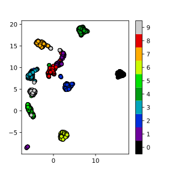

# Dimensionality Reduction

Dimensionality reduction is the process of using a subset of the coordinates, which may be transformed, 
of the dataset to capture the variation in features of the data set.  It can be a helpful pre-processing
step before doing other operations on the data, such as classification, regression or visualization.

## Dimensionality reduction with Scikit-kearn

The script below compares PCA, t-SNE and UMAP for the MNIST digits dataset.

First setup our environment and load the MNIST digits dataset which will be used as our initial example.
~~~
# https://scikit-learn.org/stable/auto_examples/decomposition/plot_pca_iris.html#sphx-glr-auto-examples-decomposition-plot-pca-iris-py
# https://scikit-learn.org/stable/auto_examples/applications/plot_face_recognition.html#sphx-glr-auto-examples-applications-plot-face-recognition-py
# https://scikit-learn.org/stable/auto_examples/cluster/plot_kmeans_digits.html#sphx-glr-auto-examples-cluster-plot-kmeans-digits-py
# https://scikit-learn.org/stable/auto_examples/manifold/plot_lle_digits.html#sphx-glr-auto-examples-manifold-plot-lle-digits-py
# https://umap.scikit-tda.org/basic_usage.html#digits-data
# https://towardsdatascience.com/how-to-program-umap-from-scratch-e6eff67f55fe
# https://dev.to/juliasilge/pca-and-umap-with-cocktail-recipes-4980
# https://pair-code.github.io/understanding-umap/
# https://pypi.org/project/umap-learn/
# https://jlmelville.github.io/uwot/abparams.html

# SETUP
# pip3 install scikit-learn
# pip3 install umap-learn

import numpy as np
import matplotlib.pyplot as plt
import umap

from sklearn import decomposition
from sklearn import datasets
from sklearn import manifold

digits = datasets.load_digits()

# Examine the dataset

print(digits.data)
#print(digits.image[0])

print(digits.target)

X = digits.data
y = digits.target

~~~
{: .python}

### Principle Component Analysis (PCA)

PCA is a technique that does rotations of data in a two dimensional
array to decompose the array into combinations vectors that are orthogonal
and can be ordered according to the amount of information they carry.

~~~
# PCA
pca = decomposition.PCA(n_components=2)
pca.fit(X)
X_pca = pca.transform(X)

fig = plt.figure(1, figsize=(4, 4))
plt.clf()
plt.scatter(X_pca[:, 0], X_pca[:, 1], c=y, cmap=plt.cm.nipy_spectral, 
        edgecolor='k',label=y)
plt.colorbar(boundaries=np.arange(11)-0.5).set_ticks(np.arange(10))
plt.savefig("pca.svg")
~~~
{: .python}

### t-distributed Stochastic Neighbor Embedding (t-SNE)

~~~
# t-SNE embedding
tsne = manifold.TSNE(n_components=2, init='pca',
        random_state = 0)
X_tsne = tsne.fit_transform(X)
fig = plt.figure(1, figsize=(4, 4))
plt.clf()
plt.scatter(X_tsne[:, 0], X_tsne[:, 1], c=y, cmap=plt.cm.nipy_spectral,
        edgecolor='k',label=y)
plt.colorbar(boundaries=np.arange(11)-0.5).set_ticks(np.arange(10))
plt.savefig("tsne.svg")
~~~
{: .python}

### Uniform Manifold Approximation (UMAP)

~~~
# umap
reducer= umap.UMAP(n_components=2, n_neighbors=15,
   random_state=42, transform_seed=42, verbose=False)
reducer.fit(digits.data)

X_umap = reducer.transform(digits.data)

fig = plt.figure(1, figsize=(4, 4))
plt.clf()
plt.scatter(X_umap[:, 0], X_umap[:, 1], c=y, cmap=plt.cm.nipy_spectral,
        edgecolor='k',label=y)
plt.colorbar(boundaries=np.arange(11)-0.5).set_ticks(np.arange(10))
plt.savefig("umap.svg")
~~~
{: .python}

> # Excercise: Working in three dimensions
> The above example has considered only two dimensions since humans
> can visualize two dimensions very well. However, there can be cases
> where a dataset requires more than two dimensions to be appropriately
> decomposed. Modify the above programs to use three dimensions and 
> create appropriate plots.
> Do three dimensions allow one to better distinguish between the digits?
> > ## Solution
> > ~~~
> > # PCA
> > pca = decomposition.PCA(n_components=3)
> > pca.fit(X)
> > X_pca = pca.transform(X)
> > # t-SNE embedding
> > tsne = manifold.TSNE(n_components=3, init='pca',
> >         random_state = 0)
> > X_tsne = tsne.fit_transform(X)
> > # umap
> > reducer= umap.UMAP(n_components=2, n_neighbors=15,
> >    random_state=42, transform_seed=42, verbose=False)
> > reducer.fit(digits.data)
> > X_umap = reducer.transform(digits.data)
> > ~~~
> > {: .python}

> # Excercise: Parameters
> Look up parameters that can be changed in PCA, t-SNE and UMAP
> and experiment with these. How do they change your resulting
> plots?  Might the choice of parameters lead you to make different
> conclusions about your data?

> # Exercise: Other Datasets
> Use PCA, t-SNE and UMAP to try to classify the
>  [Fashion MNIST dataset](https://github.com/zalandoresearch/fashion-mnist)

> # Exercise: Other Algorithms
> There are other algorithms that can be used for doing dimensionality
> reduction, for example the Higher Order Singular Value Decomposition (HOSVD)
> and Minimum Distortion Embedding. Do an internet search for some of these and
> examine the example data that they are used on. Are there cases where they do 
> poorly? What level of care might you need to use before applying such methods
> for automation in critical scenarios?  What about for interactive data 
> exploration?
