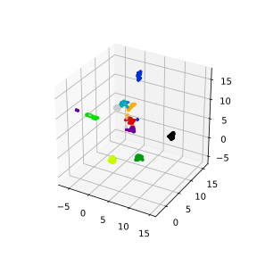
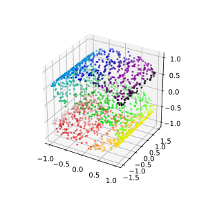
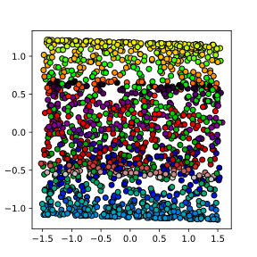
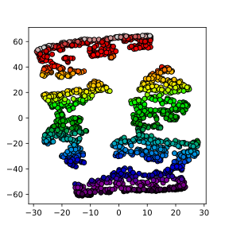
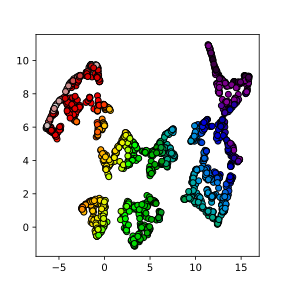

# Dimensionality Reduction

Dimensionality reduction is the process of using a subset of the coordinates, 
which may be transformed, of the dataset to capture the variation in features 
of the data set.  It can be a helpful pre-processing step before doing other 
operations on the data, such as classification, regression or visualization.

## Dimensionality Reduction with Scikit-learn

The script below compares PCA, t-SNE, UMAP and HOSVD for the MNIST digits dataset.

First setup our environment and load the MNIST digits dataset which will be used 
as our initial example.
~~~
# https://scikit-learn.org/stable/auto_examples/decomposition/plot_pca_iris.html#sphx-glr-auto-examples-decomposition-plot-pca-iris-py
# https://scikit-learn.org/stable/auto_examples/applications/plot_face_recognition.html#sphx-glr-auto-examples-applications-plot-face-recognition-py
# https://scikit-learn.org/stable/auto_examples/cluster/plot_kmeans_digits.html#sphx-glr-auto-examples-cluster-plot-kmeans-digits-py
# https://scikit-learn.org/stable/auto_examples/manifold/plot_lle_digits.html#sphx-glr-auto-examples-manifold-plot-lle-digits-py
# https://umap.scikit-tda.org/basic_usage.html#digits-data
# https://towardsdatascience.com/how-to-program-umap-from-scratch-e6eff67f55fe
# https://dev.to/juliasilge/pca-and-umap-with-cocktail-recipes-4980
# https://pair-code.github.io/understanding-umap/
# https://pypi.org/project/umap-learn/
# https://jlmelville.github.io/uwot/abparams.html

# SETUP
# pip3 install scikit-learn
# pip3 install umap-learn

import numpy as np
import matplotlib.pyplot as plt
import umap

from sklearn import decomposition
from sklearn import datasets
from sklearn import manifold

digits = datasets.load_digits()

# Examine the dataset

print(digits.data)

print(digits.target)

X = digits.data
y = digits.target

~~~
{: .python}

### Principle Component Analysis (PCA)

PCA is a technique that does rotations of data in a two dimensional
array to decompose the array into combinations vectors that are orthogonal
and can be ordered according to the amount of information they carry.

~~~
# PCA
pca = decomposition.PCA(n_components=2)
pca.fit(X)
X_pca = pca.transform(X)

fig = plt.figure(1, figsize=(4, 4))
plt.clf()
plt.scatter(X_pca[:, 0], X_pca[:, 1], c=y, cmap=plt.cm.nipy_spectral, 
        edgecolor='k',label=y)
plt.colorbar(boundaries=np.arange(11)-0.5).set_ticks(np.arange(10))
plt.savefig("pca.svg")
~~~
{: .python}

### t-distributed Stochastic Neighbor Embedding (t-SNE)

~~~
# t-SNE embedding
tsne = manifold.TSNE(n_components=2, init='pca',
        random_state = 0)
X_tsne = tsne.fit_transform(X)
fig = plt.figure(1, figsize=(4, 4))
plt.clf()
plt.scatter(X_tsne[:, 0], X_tsne[:, 1], c=y, cmap=plt.cm.nipy_spectral,
        edgecolor='k',label=y)
plt.colorbar(boundaries=np.arange(11)-0.5).set_ticks(np.arange(10))
plt.savefig("tsne.svg")
~~~
{: .python}

### Uniform Manifold Approximation (UMAP)

~~~
# umap
reducer= umap.UMAP(n_components=2, n_neighbors=15,
   random_state=42, transform_seed=42, verbose=False)
reducer.fit(X)

X_umap = reducer.transform(X)

fig = plt.figure(1, figsize=(4, 4))
plt.clf()
plt.scatter(X_umap[:, 0], X_umap[:, 1], c=y, cmap=plt.cm.nipy_spectral,
        edgecolor='k',label=y)
plt.colorbar(boundaries=np.arange(11)-0.5).set_ticks(np.arange(10))
plt.savefig("umap.svg")
~~~
{: .python}

> # Exercise: Working in three dimensions
> The above example has considered only two dimensions since humans
> can visualize two dimensions very well. However, there can be cases
> where a dataset requires more than two dimensions to be appropriately
> decomposed. Modify the above programs to use three dimensions and 
> create appropriate plots.
> Do three dimensions allow one to better distinguish between the digits?
>
> > ## Solution
> > ~~~
> > from mpl_toolkits.mplot3d import Axes3D
> > # PCA
> > pca = decomposition.PCA(n_components=3)
> > pca.fit(X)
> > X_pca = pca.transform(X)
> > fig = plt.figure(1, figsize=(4, 4))
> > plt.clf()
> > ax = fig.add_subplot(projection='3d')
> > ax.scatter(X_pca[:, 0], X_pca[:, 1], X_pca[:, 2], c=y,
> >           cmap=plt.cm.nipy_spectral, s=9, lw=0)
> > plt.savefig("pca_3d.svg")
> > ~~~
> > {. :python}
> >
> > 
> >
> > ~~~
> > # t-SNE embedding
> > tsne = manifold.TSNE(n_components=3, init='pca',
> >         random_state = 0)
> > X_tsne = tsne.fit_transform(X)
> > fig = plt.figure(1, figsize=(4, 4))
> > plt.clf()
> > ax = fig.add_subplot(projection='3d')
> > ax.scatter(X_tsne[:, 0], X_tsne[:, 1], X_tsne[:, 2], c=y,
> >           cmap=plt.cm.nipy_spectral, s=9, lw=0)
> > plt.savefig("tsne_3d.svg")
> > ~~~
> > {. :python}
> >
> > 
> >
> > ~~~
> > # umap
> > reducer= umap.UMAP(n_components=3, n_neighbors=15,
> >    random_state=42, transform_seed=42, verbose=False)
> > reducer.fit(digits.data)
> > X_umap = reducer.transform(digits.data)
> > fig = plt.figure(1, figsize=(4, 4))
> > plt.clf()
> > ax = fig.add_subplot(projection='3d')
> > ax.scatter(X_umap[:, 0], X_umap[:, 1], X_umap[:, 2], c=y,
> >           cmap=plt.cm.nipy_spectral, s=9, lw=0)
> > plt.savefig("umap_3d.svg")
> > ~~~
> > {. :python}
> >
> > 
> >
>
> # Exercise: Parameters
>
> Look up parameters that can be changed in PCA, t-SNE and UMAP
> and experiment with these. How do they change your resulting
> plots?  Might the choice of parameters lead you to make different
> conclusions about your data?
>
> # Exercise: Other Datasets
>
> ## Fashion MNIST
>
> Use PCA, t-SNE and UMAP to try to classify the
> [Fashion MNIST dataset](https://github.com/zalandoresearch/fashion-mnist)
>
> > ### Solution
> >
> > The Fashion MNIST dataset can be downloaded using [pymde]().
> >
> > ~~~
> > import trimap
> > from sklearn.datasets import load_digits
> > import matplotlib.pyplot as plt
> > import numpy as np
> > import pymde
> > import pacmap
> > import umap
> > from sklearn import decomposition
> > from sklearn import manifold
> > ### Get data
> > f_mnist = pymde.datasets.FashionMNIST()
> > X = f_mnist.data
> > y = f_mnist.attributes['class']
> >
> > ## PCA
> > pca = decomposition.PCA(n_components=2)
> > pca.fit(X)
> > X_pca = pca.transform(X)
> > fig = plt.figure(1, figsize=(4, 4))
> > plt.clf()
> > plt.scatter(X_pca[:, 0], X_pca[:, 1], c=y,
> >             edgecolor='k',label=y)
> > plt.savefig("f_mnist_pca.svg")
> > ### tsne
> > tsne = manifold.TSNE(n_components=2, init='pca',
> >        random_state = 0)
> > X_tsne = tsne.fit_transform(X)
> > fig = plt.figure(1, figsize=(4, 4))
> > plt.clf()
> > plt.scatter(X_tsne[:, 0], X_tsne[:, 1], c=y, cmap=plt.cm.nipy_spectral,
> >        edgecolor='k',label=y)
> > plt.colorbar(boundaries=np.arange(11)-0.5).set_ticks(np.arange(10))
> > plt.savefig("f_mnist_tsne.svg")
> > ### umap
> > reducer= umap.UMAP(n_components=2, n_neighbors=15,
> >   random_state=42, transform_seed=42, verbose=False)
> > reducer.fit(X)
> >
> > X_umap = reducer.transform(X)
> >
> > fig = plt.figure(1, figsize=(4, 4))
> > plt.clf()
> > plt.scatter(X_umap[:, 0], X_umap[:, 1], c=y, cmap=plt.cm.nipy_spectral,
> >        edgecolor='k',label=y)
> > plt.colorbar(boundaries=np.arange(11)-0.5).set_ticks(np.arange(10))
> > plt.savefig("f_mnist_umap.svg")
> > ### trimap
> > f_mnist_trimap = trimap.TRIMAP().fit_transform(X)
> > fig = plt.figure(1, figsize=(4, 4))
> > plt.clf()
> > plt.scatter(f_mnist_trimap[:, 0], f_mnist_trimap[:, 1], c=y, cmap=plt.cm.nipy_spectral,
> >        edgecolor='k',label=y)
> > plt.colorbar(boundaries=np.arange(11)-0.5).set_ticks(np.arange(10))
> > plt.savefig("f_mnist_trimap.svg")
> > ### PACMAP
> > f_mnist_pacmap = pacmap.PaCMAP(n_dims=2, n_neighbors=None, MN_ratio=0.5, FP_ratio=2.0).fit(X, init="pca")
> > fig = plt.figure(1, figsize=(4, 4))
> > plt.clf()
> > plt.scatter(f_mnist_pacmap[:, 0], f_mnist_pacmap[:, 1], c=y, cmap=plt.cm.nipy_spectral,
> >        edgecolor='k',label=y)
> > plt.colorbar(boundaries=np.arange(11)-0.5).set_ticks(np.arange(10))
> > plt.savefig("f_mnist_pacmap.svg")
> >
> > ### MDE
> > f_mnist_mde = pymde.preserve_neighbors(X,verbose=True).embed(verbose=True)
> > fig = plt.figure(1, figsize=(4, 4))
> > plt.clf()
> > plt.scatter(f_mnist_mde[:, 0], f_mnist_mde[:, 1], c=y, cmap=plt.cm.nipy_spectral,
> >        edgecolor='k',label=y)
> > plt.colorbar(boundaries=np.arange(11)-0.5).set_ticks(np.arange(10))
> > plt.savefig("f_mnist_pymde.svg")
> > {. :python}
> {. :solution}
>
> ## Nonlinear Manifolds
>
> The AstroML package has an [example](https://www.astroml.org/book_figures/chapter7/fig_S_manifold_PCA.html#book-fig-chapter7-fig-s-manifold-pca) 
> where principle components analysis can destroy nonlinear 
> structure, and shows that other methods can be better.
> It uses an S-curve as a dataset.
> 
> ~~~ 
> num_points = 1500
> X, color = datasets.make_s_curve(num_points, random_state=0)
>
> # change the proportions to emphasize the weakness of PCA
> X[:, 1] -= 1
> X[:, 1] *= 1.5
> X[:, 2] *= 0.5
>
> from mpl_toolkits.mplot3d import Axes3D
>
> ax = fig.add_subplot(projection='3d')
> ax.scatter(X[:, 0], X[:, 1], X[:, 2], c=color,
>            cmap=plt.cm.nipy_spectral, s=9, lw=0)
> plt.savefig("s_curve.svg")
> ~~~
> {: .python}
> 
> 
>
> Compare the two dimensional projections generated by PCA, t-SNE and UMAP
> for this data. What happens if you comment out the adjustments on
> `X[:, 1] -= 1`, `X[:, 1] *= 1.5` and `X[:, 2] *= 0.5`.
>
> > ~~~
> > # PCA
> > pca = decomposition.PCA(n_components=2)
> > pca.fit(X)
> > X_pca = pca.transform(X)
> >
> > fig = plt.figure(1, figsize=(4, 4))
> > plt.clf()
> > plt.scatter(X_pca[:, 0], X_pca[:, 1], c=color, 
> >             edgecolor='k',label=color)
> > plt.savefig("pca_s_curve.svg")
> > ~~~
> > {: .python}
> >
> > 
> >
> > ### t-distributed Stochastic Neighbor Embedding (t-SNE)
> >
> > ~~~
> > # t-SNE embedding
> > tsne = manifold.TSNE(n_components=2, init='pca',
> >        random_state = 0)
> > X_tsne = tsne.fit_transform(X)
> > fig = plt.figure(1, figsize=(4, 4))
> > plt.clf()
> > plt.scatter(X_tsne[:, 0], X_tsne[:, 1], c=color,
> >        edgecolor='k',label=color)
> > plt.savefig("tsne_s_curve.svg")
> > ~~~
> > {: .python}
> >
> > 
> >
> > ### Uniform Manifold Approximation (UMAP)
> >
> > ~~~
> > # umap
> > reducer= umap.UMAP(n_components=2, n_neighbors=15,
> >   random_state=42, transform_seed=42, verbose=False)
> > reducer.fit(X)
> >
> > X_umap = reducer.transform(X)
> >
> > fig = plt.figure(1, figsize=(4, 4))
> > plt.clf()
> > plt.scatter(X_umap[:, 0], X_umap[:, 1], c=color,
> >        edgecolor='k',label=color)
> > plt.savefig("umap_s_curve.svg")
> > ~~~
> > {: .python}
> >
> > 
> >
>
> ## Raman Spectra
> PCA can be used to characterize Raman spectra in cartilage samples to
> distinguish between different constituents.
> ~~~
> import pandas as pd
> import numpy as np
> import tensorly as tl
>
> specdata = pd.read_csv('chondro.txt',sep='\s+',header=None)
> specdata = specdata.interpolate(method='linear',limit_direction='forward')
> pca = decomposition.PCA(n_components=2)
> pca.fit(specdata.to_numpy())
> specdata_pca = pca.transform(specdata.to_numpy())
>
> fig = plt.figure(1, figsize=(4, 4))
> plt.clf()
> plt.scatter(specdata_pca[:, 0], specdata_pca[:, 1], edgecolor='k')
> plt.colorbar()
> plt.savefig("specdata_pca.png")
>
> # convert to tensor
> x = np.unique((specdata[[0]]).to_numpy())
> y = np.unique((specdata[[1]]).to_numpy())
> raman_shift = np.unique((specdata[[2]]).to_numpy())
> intensity = (specdata[[3]]).to_numpy()
> intensity = np.reshape(intensity, [ raman_shift.size, y.size, x.size])
>
> ~~~
> {: .python}
>
> Find areas in physics where spectroscopic data is also collected.
> Discuss how similar dimension reduction techniques may be useful when
> examining such data
>
> > ## Solution
> > [DESI (Dark Energy Spectroscopic Instrument)](https://www.desi.lbl.gov/) 
>
> ## Galaxies
>
> Classifying galaxies is also important. Example data is available on the
> [Galaxy zoo](https://data.galaxyzoo.org/) and 
> [Sloan Digital Sky Survey](https://www.sdss.org) webpages. These datasets 
> are quite large.  More managable datasets are the 
> [Kaggle galaxy zoo challenge](https://www.kaggle.com/c/galaxy-zoo-the-galaxy-challenge/data),
> the [EFIGI catalogue of 4458 nearby galaxies with morphology](http://cdsarc.u-strasbg.fr/viz-bin/qcat?J/A+A/532/A74),
> the [Zsolt Frei dataset](http://www.zsolt-frei.net/galaxy_catalog.html),
> the [Galaxy 10](https://github.com/henrysky/Galaxy10),
> and the [Galaxy 10 SDSS](https://astronn.readthedocs.io/en/latest/galaxy10sdss.html#download-galaxy10-sdss) datasets.
> Use PCA, t-SNE, UMAP and HOSVD to try and classify the galaxies in one of these datasets. 
>
> > ## Solution
> > The [Galaxy 10 SDSS](https://astronn.readthedocs.io/en/latest/galaxy10sdss.html#download-galaxy10-sdss) 
> > is about 200Mb, has been pre-processed and contains images which are useful for introducing
> > machine learning.
> > ~~~
> > # PCA
> > import numpy as np
> > import matplotlib.pyplot as plt
> > import umap
> > from PIL import Image
> > from sklearn import decomposition
> > from sklearn import manifold
> >
> > imagenumbers=[2403,2541,2683,2715,2768,2775,2903,2976,2985,3031,
> >              3077,3079,3147,3166,3184,3198,3319,3344,3351,3368,
> >              3377,3379,3486,3556,3596,3623,3631,3672,3675,3726,
> >              3810,3877,3893,3938,3953,4013,4030,4088,4123,4125,
> >              4136,4144,4157,4178,4189,4192,4216,4242,4254,4258,
> >              4303,4321,4340,4365,4374,4394,4406,4414,4429,4442,
> >              4449,4450,4472,4477,4486,4487,4498,4501,4526,4527,
> >              4535,4548,4559,4564,4569,4571,4579,4593,4594,4621,
> >              4636,4651,4654,4689,4710,4725,4731,4754,4826,4861,
> >              4866,5005,5033,5055,5204,5248,5322,5334,5364,5371,
> >              5377,5585,5669,5701,5746,5792,5813,5850,5985,6015,
> >              6118,6384,6503]
> > imagedata=np.empty(30000,dtype='uint8')
> > for i in imagenumbers:
> >     fname='sml_'+str(i)+'.jpg'
> >     im = np.array(Image.open(fname))
> >     im=np.ndarray.flatten(im)
> >     np.append(imagedata,im)
> >
> > imagedata.resize(30000,len(imagenumbers))
> > 
> > X=imagedata
> > pca = decomposition.PCA(n_components=2)
> > pca.fit(X)
> > X_pca = pca.transform(X)
> >
> > fig = plt.figure(1, figsize=(4, 4))
> > plt.clf()
> > plt.scatter(X_pca[:, 0], X_pca[:, 1],  cmap=plt.cm.nipy_spectral,
> >        edgecolor='k')
> > #plt.colorbar()
> > plt.savefig("pcaZF.svg")
> >
> > tsne = manifold.TSNE(n_components=2, init='pca',
> >        random_state = 0)
> > X_tsne = tsne.fit_transform(X)
> > fig = plt.figure(1, figsize=(4, 4))
> > plt.clf()
> > plt.scatter(X_tsne[:, 0], X_tsne[:, 1], cmap=plt.cm.nipy_spectral,
> >        edgecolor='k')
> > #plt.colorbar()
> > plt.savefig("tsneZF.svg")
> >
> > reducer= umap.UMAP(n_components=2, n_neighbors=15,
> >   random_state=42, transform_seed=42, verbose=False)
> > reducer.fit(X)
> >
> > X_umap = reducer.transform(X)
> >
> > fig = plt.figure(1, figsize=(4, 4))
> > plt.clf()
> > plt.scatter(X_umap[:, 0], X_umap[:, 1], cmap=plt.cm.nipy_spectral,
> >        edgecolor='k')
> > #plt.colorbar()
> > plt.savefig("umapZF.svg")
> > ~~~
> > {: .python}
> >
> # Exercise: Other Algorithms
>
> There are other algorithms that can be used for doing dimensionality
> reduction, for example the Higher Order Singular Value Decomposition (HOSVD)
> [Large-scale Dimensionality Reduction Using Triplets (TriMAP)](https://github.com/eamid/trimap), 
> [Pairwise Controlled Manifold Approximation Projectio (PaCMAP)](https://github.com/YingfanWang/PaCMAP) and 
> [Minimum Distortion Embedding](https://pymde.org/). Do an internet search for some of these and
> examine the example data that they are used on. Are there cases where they do 
> poorly? What level of care might you need to use before applying such methods
> for automation in critical scenarios?  What about for interactive data 
> exploration?

# References
- Connolly, Szalay, Bershady, Kinney and Calzetti, [Spectral classification of galaxies: an orthogonal approach](https://arxiv.org/abs/astro-ph/9411044)
- Connolly and Szalay, [A Robust Classification of Galaxy Spectra: Dealing with Noisy and Incomplete Data](https://arxiv.org/abs/astro-ph/9901300)
- Dielman, Willett and Dambre, [Rotation-invariant convolutional neural networks for galaxy morphology prediction](https://arxiv.org/abs/1503.07077)
- Selim, Keshk and Shourbygy, [Galaxy Image Classification using Non-Negative Matrix Factorization](https://www.ijcaonline.org/research/volume137/number5/i.m.selim-2016-ijca-908387.pdf)
- Khalifa, Taha, Hassanien and Selim, [Deep Galaxy: Classification of Galaxies based on Deep Convolutional Neural Networks](https://arxiv.org/abs/1709.02245)
- Leung and Bovy, [Galaxy10](https://github.com/henrysky/Galaxy10)
- Baillard et al., [The EFIGI catalogue of 4458 nearby galaxies with detailed morphology](https://www.aanda.org/articles/aa/pdf/2011/08/aa16423-10.pdf)
- Bonifacio et al., [Chemical imaging of articular cartilage sections with Raman mapping, employing uni- and multi-variate methods for data analysis](https://doi.org/10.1039/c0an00459f)
- Rabanser, Shchur and Günnemann, [Introduction to Tensor Decompositions and their Applications in Machine Learning](https://arxiv.org/abs/1711.10781)
- Understanding Tensors and Tensor Decomposition, [Part 1](https://iksinc.online/2018/02/12/understanding-tensors-and-tensor-decompositions-part-1/), [Part 2](https://iksinc.online/2018/04/03/understanding-tensors-and-tensor-decompositions-part-2/), [Part 3](https://iksinc.online/2018/05/02/understanding-tensors-and-tensor-decompositions-part-3/)
